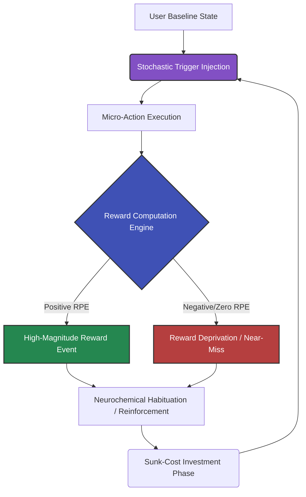

# Gotcha It!

A dark premium arcade style Android application.

## Overview
**Gotcha It!** is built using modern Android development practices, leveraging Kotlin and Jetpack Compose for a fluid, responsive user experience. It features a dark, premium aesthetic tailored for an engaging arcade style.

## Tech Stack
* **Language:** Kotlin
* **UI Framework:** Jetpack Compose (Material 3)
* **Architecture:** Clean Architecture / MVVM
* **Build System:** Gradle (Kotlin DSL)

## Getting Started
To run the project in a standard Android development environment:
1. Open the project in Android Studio.
2. Allow Gradle to resolve dependencies and sync the project.
3. Click "Run" or deploy the app to an emulator or physical device running API 26 or higher.

## Project Structure
* `app/src/main/java/...` - Kotlin source code (Composables, ViewModels, Data layer).
* `app/src/main/res/...` - Android resources (Drawables, Colors, Themes).
* `build.gradle.kts` - Gradle configuration using modern Version Catalogs (`libs.versions.toml`).

## Behavioral Analysis & Addiction Mechanics

**Gotcha It!** serves as an experimental paradigm to investigate operant conditioning and habit-forming behaviors within digital environments. Designed strictly for scientific and research purposes, the application models extreme levels of user engagement by modulating neuro-behavioral reward pathways.

### Theoretical Framework

The application's engagement matrix is predicated on the **Reward Prediction Error (RPE)** computational model of dopamine scaling, articulated as:

$$
\delta_t = r_t + \gamma V(s_{t+1}) - V(s_t)
$$

Where:
* $\delta_t$ is the prediction error at time $t$.
* $r_t$ is the actual reward received.
* $\gamma$ is the temporal discount factor.
* $V(s)$ represents the expected subjective value of state $s$.

By establishing a baseline expectation $V(s_t)$ and introducing highly variable, unpredictable rewards $r_t$, the application maximizes the variance of $\delta_t$, thereby stimulating sustained dopaminergic output. 

Furthermore, the engagement trajectory is modeled utilizing a digitized variation of the **Rescorla-Wagner Model** to calculate the associative strength ($V$) of application stimuli over successive trials:

$$
\Delta V = \alpha \beta (\lambda - \Sigma V)
$$

Here, continuous tuning of the salience of stimuli ($\alpha$) and the learning rate of the behavioral schedule ($\beta$) structurally inhibits the habituation effect ($\Sigma V \to \lambda$), resulting in prolonged compulsory interaction.

### Engagement Architecture

The system architecture integrates a continuous limbic feedback loop, visually represented below using a stochastic hook framework:

## Disclaimer

**DISCLAIMER:** This application and its documented conceptual models are designed *strictly* for academic, scientific, and behavioral research purposes. The mechanisms described herein pertain to the psychological analysis of digital addiction, behavioral loops, and operant conditioning. The maintainers do not endorse the commercial weaponization of habit-forming technologies. Please use ethically and responsibly.

## Author

I'm Techiral (Lakshya Gupta) and my github is https://github.com/lakshyabuilds.
